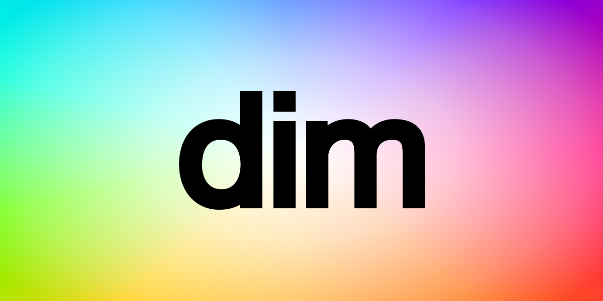

# Ufuktan Yıldırım

Software developer with an MSc in CE who spent the last decade experimenting with end-to-end software based product development, shaping arbitrary app ideas into working prototypes using Sketch, Go, CSS and TypeScript.

I enjoy bootstrapping infrastructure, from spinning up Linux server clusters with GNU tools to automating operations using Shell scripts, Terraform, and Ansible. A dedicated Git enthusiast, I regularly contribute to open source and continuously experiment with GitHub CI workflows. I'm the creator of open source tools Gohandlers and Gonfique which are enforcing type safety and improve reliability on the two big ongoing problems of Go backend development.

My research was on applying genetic programming on finding the test-passing Go functions using recombinating and selecting fitter ASTs. Previously wrote Python for Reddit data visualization and agent-based social network simulation on the theory of Diffusion of Innovations. I'm familiar with iOS development using Swift and UIKit. Had a commit once on the Packer repository to enable configuring DigitalOcean droplets closed to outside private network.

I'm slightly biased towards B2C, valuing a software's impact on public. Interested on the areas in-touch with PM and marketing.

Still waiting for the day I finally have enough credits to fully explore AWS or GCP on scale.

## Contact

<a href="mailto:ufukty@gmail.com">ufukty@gmail.com</a>

## Profiles

-   [GitHub](https://github.com/ufukty)
-   [LinkedIn](https://linkedin.com/in/ufukty)

## Tools

Tools with example work in this page:

-   **Go**: [Gohandlers](#gohandlers-2025), [Gonfique](#gonfique-2024-2025), [Kask](#kask-2025), [ovpn-auth](#ovpn-auth-2021-2025), [Bump](#bump-2024-2025)
-   **Python**: [Diffusion of Innovation](#diffusion-of-innovation-simulation-2020), [Reddit Galaxy](#reddit-galaxy-2020)
-   **TypeScript (JavaScript)**: [Gonfique Playground](#gonfique-playground-2024-2025), [Dim](#dim-2024-2025)
-   **PHP**: [Poor Man's Social Media](#poor-man-s-social-media-2016-2024)
-   **C++**: [Ball & Stick Man](#ball-stick-man-2016), [TicTacToe AI](#tictactoe-ai-2014-2018)

Tools with examples on GitHub:

-   **Bash**: [Droplet creation, templating and server configuration](https://github.com/ufukty/logbook/blob/d1e9bd9df6997e0ddc24b49f2e4d0c12e0fb95aa/platform/stage/deploy/vpn/local.sh)
-   **Terraform**: [PR for base32 support](https://github.com/hashicorp/terraform/pull/29127)
-   **Packer**: [PR for connecting droplets via private IP](https://github.com/hashicorp/packer/pull/10093)
-   **Make**: [Gonfique Makefile](https://github.com/ufukty/gonfique/blob/76ba1921e817d31a474a9d7362344087b7b34c66/Makefile)

## Public projects

### Gohandlers (2025)

Generate code for strongly typed and reflectionless request-response binding, request validation, registering routes and Go clients.

**Highlights:**

-   Go
-   AST

**Links:**

-   [GitHub](https://github.com/ufukty/gohandlers)
-   [Docs](https://gohandlers.pages.dev/)

### Kask (2025)

A static website generator allows developer-writer collaboration without synchronization.

**Highlights:**

-   Go
-   Templating

**Links:**

-   [GitHub](https://github.com/ufukty/kask)

### Bump (2024-2025)

Smallest compiled CLI utility bumps with one command.

**Highlights**

-   Go
-   Git
-   Semantic versioning
-   Developer experience

**Links**

-   [GitHub](https://github.com/ufukty/bump)

### Gonfique Playground (2024-2025)

Brings Gonfique to browsers.

**Highlights:**

-   TypeScript
-   Microsoft Monaco
-   Go WASM

**Links:**

-   [Playground](https://gonfique.pages.dev)
-   [GitHub](https://github.com/ufukty/gonfique-playground)

### Gonfique (2024-2025)

Customizable and offline YAML and JSON to Go for config files.

**Highlights:**

-   Go
-   Code generator

**Links:**

-   [GitHub](https://github.com/ufukty/gonfique)

### Dim (2024-2025)

A Visual Studio Code extension lets you define regex rules to dim boring parts of code and make the main logic pop.

**Highlights:**

-   Developer Experience
-   Visual Studio Code Extensions API

**Links:**

-   [Marketplace](https://marketplace.visualstudio.com/items?itemName=ufukty.dim)
-   [GitHub](https://github.com/ufukty/dim)

### Ovpn Auth (2021-2025)

Simple to use, easy to deploy 2FA login for OpenVPN servers.

**Highlights:**

-   Go
-   Security

**Links:**

-   [GitHub](https://github.com/ufukty/ovpn-auth)

### Reddit Galaxy (2020)

Visualization of the links between subreddits.

**Highlights:**

-   Network visualization
-   Python
-   Matplotlib

**Links:**

-   [GitHub](https://github.com/ufukty/reddit-galaxy)

### Diffusion of Innovation simulation (2020)

Simulates the spread of hypothetical innovation throughout from its genesis to total market domination to observe S-curve phenomenon and the influence of populars on communities with varying topologies.

**Highlights:**

-   Agent based simulation
-   Python
-   NetworkX
-   Matplotlib

**Links:**

-   [GitHub](https://github.com/ufukty/diffusion-of-innovation)

### Ball & Stick Man (2016)

A basic 3D demonstration with a movable camera, animated arms, a “tour” mode, and waving interactions.

**Highlights:**

-   Computer graphics

**Links:**

-   [GitHub](https://github.com/ufukty/ball-and-stick-man)

### Poor Man's Social Media (2016,2024)

Social network backend and frontend. Written with JS and PHP demonstrating connection status manipulation and asynchronous API calls.

**Highlights:**

-   Social media
-   Web application

**Links:**

-   [GitHub](https://github.com/ufukty/poor-man-s-social-media)

### TicTacToe AI (2014-2018)

Complete implementation of unbeatable TicTacToe game.

**Highlights:**

-   Visual C++
-   Alpha-Beta pruning

**Links:**

-   [GitHub](https://github.com/ufukty/TicTacToe-AI)
