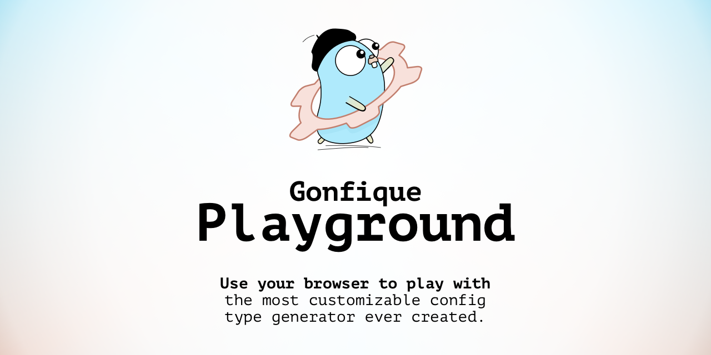

# Ufuktan Yıldırım

Turkish Software Developer with an MSc in Computer Engineering from Ankara University (2024)

## Contact

<a href="mailto:ufukty@gmail.com">ufukty@gmail.com</a>

## Profiles

-   [GitHub](https://github.com/ufukty)
-   [LinkedIn](https://linkedin.com/in/ufukty)

## Tools and example work

**Go**

-   [Gohandlers](https://github.com/ufukty/gohandlers) A CLI utility which generates handler helpers for parsing, building/writing and validating request and response structs; route lister; client implementation and client interface with type safety and zero reflection.
-   [Gonfique](https://github.com/ufukty/gonfique) A code generator written in Go that produces Go code from YAML or JSON file.
-   [Kask](https://github.com/ufukty/kask) A static site generator supports html-markdown mixed content, hierarchical CSS code splitting, and Go template propagation.
-   [ovpn-auth](https://github.com/ufukty/ovpn-auth) An easy-to-deploy OpenVPN authorization agent written in Go that works offline. It supports time-based one-time passwords (TOTPs) and password checks, and uses Argon2 for hashing.

**Python**

-   [Diffusion of Innovation](https://github.com/ufukty/diffusion-of-innovation) A Python script built with NetworkX and Matplotlib’s pyplot to simulate the spread of a hypothetical innovation.
-   [reddit-galaxy](https://github.com/ufukty/reddit-galaxy) A Python and NetworkX project using Matplotlib’s pyplot. Processes the dataset in Scala.

**Bash, Make**

-   [Droplet creation, templating and server configuration](https://github.com/ufukty/logbook/blob/main/platform/stage/deploy/vpn/local.sh)

**JavaScript, TypeScript**

-   [Gonfique Playground](https://github.com/ufukty/gonfique-playground) Written in TypeScript and compiled to JavaScript via Vite, built on Microsoft Monaco and loads a Go WASM binary.
-   [Dim](https://github.com/ufukty/dim) A Visual Studio Code extension written in TypeScript

**Terraform, Packer (DigitalOcean)**

-   [PR](https://github.com/hashicorp/terraform/pull/29127) for enabling Terraform users to encode and decode base32 strings
-   [PR](https://github.com/hashicorp/packer/pull/10093) for enabling Packer users to direct the provisioner to connect over private IP of droplet

**PHP**

-   [Poor Man's Social Media](https://github.com/ufukty/poor-man-s-social-media) WA PHP application that processes AJAX-based API requests and serves a simple frontend with basic JavaScript interactivity.

**C++**

-   [TicTacToe AI with TUI](https://github.com/ufukty/TicTacToe-AI) Implements alpha-beta pruning for TicTacToe.
-   [ball-and-stick-man](https://github.com/ufukty/ball-and-stick-man) Written in C++ with GLUT for basic 3D character movement and interactions.

## Previews

### Gonfique Playground

[GitHub](https://github.com/ufukty/gonfique-playground)

Gonfique Playground brings Gonfique to the browser. It is a web app built on the Monaco editor and Golang WASM, providing an extremely responsive development environment where you can see the results of changes to the input file and Gonfique config in real time. Written in TypeScript and built with Vite to produce static files, it still works offline.

### Gonfique

[GitHub](https://github.com/ufukty/gonfique)

An offline, customizable tool that generates Go code for YAML or JSON files, designed for those seeking an alternative to Mholt’s JSON-to-Go. The pre-alpha of version 2 introduces new features such as overriding resolved type expressions, implementing struct iterators, providing a choice between struct or map representations for JSON/YAML objects, and assigning parent references to nodes. It also improves existing capabilities, such as auto-generated type names that avoid collisions by choosing the shortest semantically valid name, and importing external packages for type replacement.

### Dim

[GitHub](https://github.com/ufukty/dim)

A Visual Studio Code extension that reduces the opacity of matching statements and expressions to help the main logic stand out. Originally intended for pushing Go’s error-wrapping blocks and JavaScript logging lines slightly into the background.

### ovpn-auth

[GitHub](https://github.com/ufukty/ovpn-auth)

Provides basic authentication for an OpenVPN server. It supports TOTP-based codes and password checks and uses Argon2 to handle hashing securely.

### Reddit

[GitHub](https://github.com/ufukty/reddit-galaxy)

Shows the connections between subreddits based on shared links; one end of the link is orange, the other is blue. Built with Apache Spark, Python, and Matplotlib.

### Diffusion of Innovation simulation (2020)

[GitHub](https://github.com/ufukty/diffusion-of-innovation)

Simulates the spread of a hypothetical innovation in different types of communities, where members progress through seven states (from initial awareness to confirmation). Observes the resulting s-curve of adoption and the role of high-degree nodes. Created using Python, Matplotlib, and NetworkX.

### ball-and-stick-man (2016)

[GitHub](https://github.com/ufukty/ball-and-stick-man)

A basic 3D demonstration with a movable camera, animated arms, a “tour” mode, and waving interactions. Created with C++ and OpenGL (GLUT).

### Poor Man's Social Media (2016,2024)

[GitHub](https://github.com/ufukty/poor-man-s-social-media)

A PHP-based application that processes AJAX calls to an API and provides a straightforward frontend for user interaction with JavaScript.

