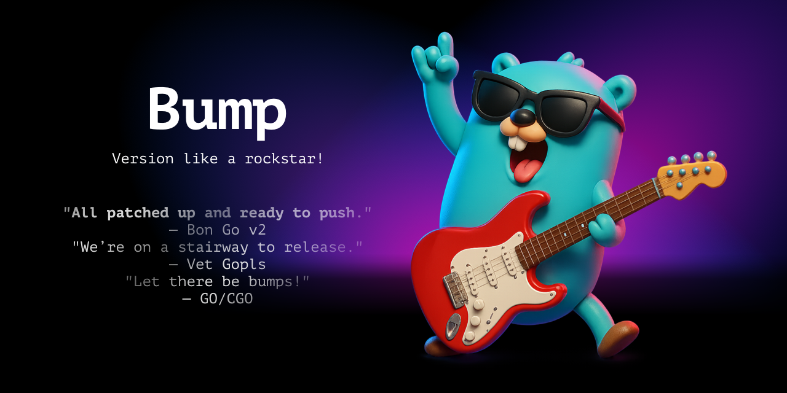

{#profile-shot}

# Ufuktan Yıldırım

MSc in Computer Engineering with 10+ years of experience spanning full-stack
development, developer tooling, and independent product ventures. Started with peering
a Bachelor’s capstone project that evolved into a independent venture; an ambitious
social utility app combining mobile and backend development with face-recognition
features. Paused this to focus on another venture, a leaner project on personal product
management tool area, reusing technical foundations while producing impactful open-
source developer tools (e.g., Gohandlers, Gonfique, Dim). Published a master’s thesis on
genetic programming and explored network science through simulations and data
visualizations (e.g., Reddit Galaxy, featured with 5k+ upvotes). Passionate about bridging
deep technical execution with product strategy; from backend architectures and web
application security to branding, documentation, and market validation. Motivated to
contribute to B2C software with high user engagement and to help shape early-stage
product growth.

[Download my CV](.assets/CV.2025.09.27.pdf)

## Contact

<a href="mailto:ufukty@gmail.com">ufukty@gmail.com</a>

## Profiles

-   [GitHub](https://github.com/ufukty)
-   [LinkedIn](https://linkedin.com/in/ufukty)
-   [Visual Studio Marketplace](https://marketplace.visualstudio.com/publishers/ufukty)
-   [StackOverflow](https://stackoverflow.com/users/10272920/ufukty)
-   [X](https://x.com/ufukty)
-   [Bluesky](https://bsky.app/profile/ufukty.bsky.social)
-   [Hugging Face](https://huggingface.co/ufukty)
-   [Reddit](https://www.reddit.com/user/ufukty/comments/?sort=top)

## Tools

Tools with example work in this page:

-   **Go**: [Gohandlers](#gohandlers), [Gonfique](#gonfique), [Kask](#kask), [ovpn-auth](#ovpn-auth), [Bump](#bump)
-   **Python**: [Diffusion of Innovation](#diffusion-of-innovation-simulation), [Reddit Galaxy](#reddit-galaxy)
-   **TypeScript (JavaScript)**: [Gonfique Playground](#gonfique-playground), [Dim](#dim)
-   **PHP**: [Poor Man's Social Media](#poor-man-s-social-media)
-   **C++**: [Ball & Stick Man](#ball-stick-man), [TicTacToe AI](#tictactoe-ai)

Tools with examples on GitHub:

-   **Bash**: [Droplet creation, templating and server configuration](https://github.com/ufukty/logbook/blob/d1e9bd9df6997e0ddc24b49f2e4d0c12e0fb95aa/platform/stage/deploy/vpn/local.sh)
-   **Terraform**: [PR for base32 support](https://github.com/hashicorp/terraform/pull/29127)
-   **Packer**: [PR for connecting droplets via private IP](https://github.com/hashicorp/packer/pull/10093)
-   **Make**: [Gonfique Makefile](https://github.com/ufukty/gonfique/blob/76ba1921e817d31a474a9d7362344087b7b34c66/Makefile)

## Public projects

### Gohandlers

Generate code for strongly typed and reflectionless request-response binding, request validation, registering routes and Go clients.

**Highlights:**

-   Year: 2025
-   Go
-   AST

**Links:**

-   [GitHub](https://github.com/ufukty/gohandlers)
-   [Docs](https://gohandlers.pages.dev/)

### Kask

A static website generator allows developer-writer collaboration without synchronization.

**Highlights:**

-   Year: 2025
-   Go
-   Templating

**Links:**

-   [GitHub](https://github.com/ufukty/kask)

### Bump

Smallest compiled CLI utility bumps with one command.

**Highlights**

-   Years: 2024-2025
-   Go
-   Git
-   Semantic versioning
-   Developer experience

**Links**

-   [GitHub](https://github.com/ufukty/bump)

### Gonfique Playground

Brings Gonfique to browsers.

**Highlights:**

-   Years: 2024-2025
-   TypeScript
-   Microsoft Monaco
-   Go WASM

**Links:**

-   [Playground](https://gonfique.com)
-   [GitHub](https://github.com/ufukty/gonfique-playground)

### Gonfique

Customizable and offline YAML and JSON to Go for config files.

**Highlights:**

-   Years: 2024-2025
-   Go
-   Code generator

**Links:**

-   [GitHub](https://github.com/ufukty/gonfique)

### Dim

A Visual Studio Code extension lets you define regex rules to dim boring parts of code and make the main logic pop.

**Highlights:**

-   Years: 2024-2025
-   Developer Experience
-   Visual Studio Code Extensions API

**Links:**

-   [Marketplace](https://marketplace.visualstudio.com/items?itemName=ufukty.dim)
-   [GitHub](https://github.com/ufukty/dim)

### TDE

Tooling for finding test-passing Go code using Genetic Programming.

**Highlights**

-   Years: 2023-2024
-   Research
-   Published as a Master's thesis

**Links**

-   [GitHub](https://github.com/ufukty/tde)
-   [The thesis (in Turkish)](https://tez.yok.gov.tr/UlusalTezMerkezi/TezGoster?key=weFMBHaUra8rsS5wi2bmHDKlIvi-IwlFkdPWTMwNi0k9Pt1C4PzNAFzxcjzHPgAW)

### Ovpn Auth

Simple to use, easy to deploy 2FA login for OpenVPN servers.

**Highlights:**

-   Years: 2021-2025
-   Go
-   Security

**Links:**

-   [GitHub](https://github.com/ufukty/ovpn-auth)

### Reddit Galaxy

Visualization of the links between subreddits.

**Highlights:**

-   Year: 2020
-   Network visualization
-   Python
-   Matplotlib

**Links:**

-   [GitHub](https://github.com/ufukty/reddit-galaxy)

### Diffusion of Innovation simulation

Simulates the spread of hypothetical innovation throughout from its genesis to total market domination to observe S-curve phenomenon and the influence of populars on communities with varying topologies.

**Highlights:**

-   Year: 2020
-   Agent based simulation
-   Python
-   NetworkX
-   Matplotlib

**Links:**

-   [GitHub](https://github.com/ufukty/diffusion-of-innovation)

### Ball & Stick Man

A basic 3D demonstration with a movable camera, animated arms, a “tour” mode, and waving interactions.

**Highlights:**

-   Year: 2016
-   Computer graphics

**Links:**

-   [GitHub](https://github.com/ufukty/ball-and-stick-man)

### Poor Man's Social Media

Social network backend and frontend. Written with JS and PHP demonstrating connection status manipulation and asynchronous API calls.

**Highlights:**

-   Years: 2016-2024
-   Social media
-   Web application

**Links:**

-   [GitHub](https://github.com/ufukty/poor-man-s-social-media)

### TicTacToe AI

Complete implementation of unbeatable TicTacToe game.

**Highlights:**

-   Years: 2014-2018
-   Visual C++
-   Alpha-Beta pruning

**Links:**

-   [GitHub](https://github.com/ufukty/TicTacToe-AI)
